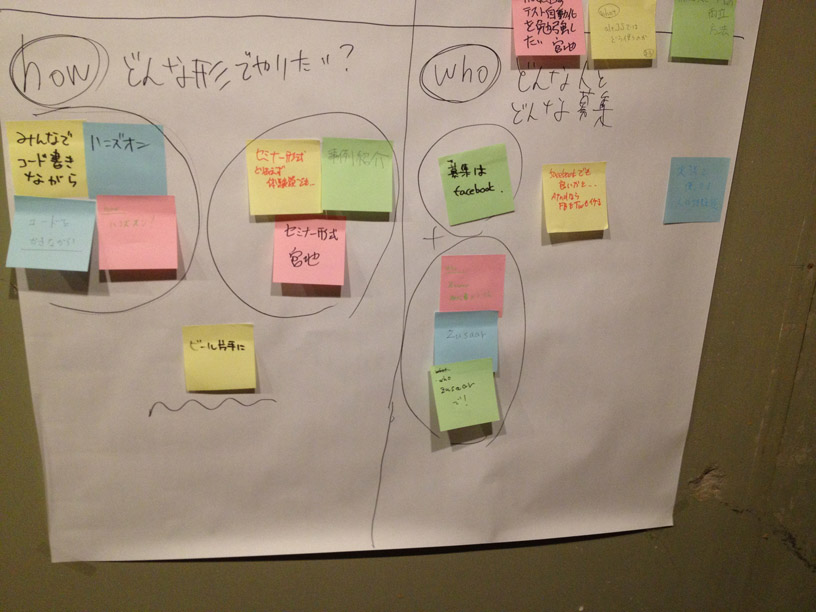

 JavaScriptテスト勉強会＠福岡 #0 議事メモ
=======================================

 概要 
--------

* 日時 : 2013/9/25(水) 19:00-22:00(懇親会終了)
* 場所 : 西中洲スレッド
* 募集 : zusaar [http://www.zusaar.com/event/1054010](http://www.zusaar.com/event/1054010)
* 実参加者 : 12名 たぶん・・・

 アジェンダ
-----------

1. 主催から挨拶
2. 会場提供者様より施設の使い方の案内
3. 勉強会の進め方について検討(本題)
4. 懇親会

         本当はKPTやりたかったけど忘れてた(*ﾉω・*)ﾃﾍ

 議事
-------

* 今後どんな形で勉強会を開催していくかを検討
* 模造紙に5W1Hを書き出して、参加者それぞれの希望や思いを付箋紙に書いて貼り付けてもらった

以下、結果

### why / なぜJSテストを勉強したいとおもったか ###

* 確認した項目の記録として
* 高速で高品質な開発を要求されているから
* デグレのチェック(単体テストの自動化)
* スマートフォンをテストするのを自動化したい
* 手動じゃ限界です
* テストを書いて品質を良くしたい
* JavaScriptの大規ぼ化
* そもそも何のテストをしたらよいのかわからない
* 長く使いたい
* 仕事に生かせそうなので
* みなさんのソースが見てみたい
* そもそもJSが好きだから
* オレ、Jasmine使ってるんだよ。とか言うとカッコよさそうなので

### what / 勉強会では何を知りたい? ###

* スマートフォンでのテスト自動化
* JSのモデルのテストはJasmine JS(DOM)のテストはスレニウムがしたい！
* Seleniumを使ってChrome, IE9異常で動作テストをしたい
* E2Eテスト selenium 興味あるが実際に導入するハードル高そうなのでどう導入するかも話したい
* WebDriverでend2endのテストをしたい
* クライアントMVC(backbone.js)のテスト viewのテストって書く？とか...
* なんてテスト書きにくいんだけど…
* JSテストの自動化、CI
* Gruntとか使ってみたい
* Gruntなどの連携
* IE6でもテストしたい
* PhantomJSでのテスト
* nodejsのテスト自動化を勉強したい
* altJSではどう使うのか
* 開発スピードの両立方法
* どんなツールがあるの？を手ほどき

### how / どういう形式で勉強会をやりたい? ###

* セミナー形式とりあえず体験談でも...
* セミナー方式
* 事例紹介
* みんなでコード書きながら
* ハンズオン
* コードをかきながら
* ハンズオン！
* ビール片手に

### who / どんな人に教えてもらいたい?イベントはどう人を呼ぶのがいい? ###

* 実務で使っている人の体験談
* 募集はfacebook
* facebookでも良いかと...antdならFBもTWもイケる
* Zusssar初心者からOK
* Zussaar
* zusaarで!

### when / 勉強会はいつ開催するのがいい? ###

* 平日の夜キボウ
* 平日夜
* 平日
* 土曜の昼
* いつでも

### where / 勉強会はどこで開催するのがいい? ###

* 西中洲スレッド！すばらしー！
* ココ！天神
* 地下鉄の近い所
* 天神が便利かなぁ
* 福岡県内でしたら!!
* MENTビル
* 秘密の場所

 ざっくりまとめ
----------------

### why ###
みんな色んなことを考えるねーφ(ﾟДﾟ )ﾌﾑﾌﾑ…

### what ###
「ユニットテスト」「seleniumでの結合テスト」「GruntやCI等の実行環境周り」に興味ある人多い。まずはこのへんから勉強会のネタにしよう。他諸々もいつか。

### how ###
キホンはセミナー方式で。ハンズオンもいいんだけど、準備する人が大変だったり環境が整ってなくてごたついたりするので難しいので、やれたらやる。

### who ###
キホンはzusaar+facebookで告知。

### when ###
キホンは平日夜。ハンズオンとか時間がかかったり大きな会場で勉強会する時は、土曜日の昼とかでも良いかも。

### where ###
キホンは天神。大人数を呼

### 次回予定 ###
2013/10/16(水)＠西中洲スレッドにて（仮）